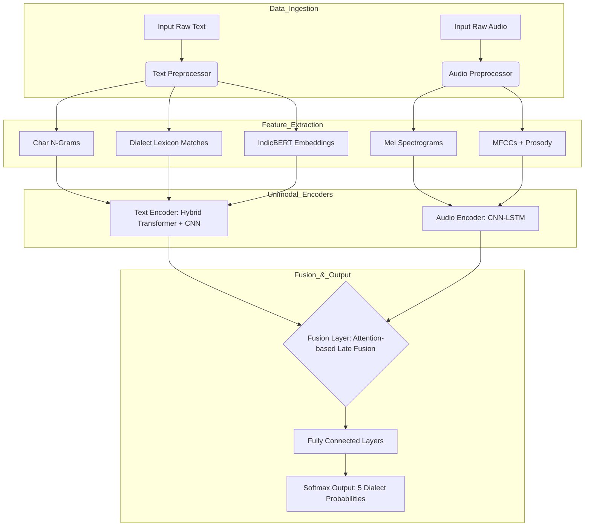

# Gujarati Dialect Intelligence System (GDIS) - Design Specification

## 1. System Architecture

### Pipeline Diagram


### Component Justification
*   **Data Ingestion**: Separates text and audio streams to allow for unimodal or multimodal inference.
*   **Preprocessing**: Critical for low-resource languages to normalize inconsistent spellings (Text) and remove silence/noise (Audio).
*   **Feature Extraction**:
    *   *Text*: Combining statistical (N-grams) and semantic (BERT) features captures both morphological variations (strong dialect indicators) and context.
    *   *Audio*: Mel Spectrograms capture frequency patterns; Prosody (Pitch/Energy) captures tonal variations specific to dialects like Kathiawadi.
*   **Unimodal Encoders**: Separate processing allows the model to learn modality-specific representations before trying to correlate them.
*   **Fusion Strategy**: Attention-based fusion weighs the more confident modality higher, handling cases where one input is noisy or missing.

---

## 2. Dataset Design

### 2.1 Text Dataset

*   **Data Sources**:
    *   *Literature*: Gujarati Wikisource (categorized by region/author origin).
    *   *News*: Regional newspapers (e.g., Akila for Saurashtra/Kathiawadi, Gujarat Samachar for Standard).
    *   *Social Media*: Scraped YouTube comments on regional comedy/drama channels; Twitter API filtered by geolocation and Gujarati script.
    *   *Seed Lexicons*: Bhagavadgomandal and regional dictionaries.
*   **Labeling Strategy**:
    *   *Weak Supervision*: Use keyword lists (dialect-specific markers) to auto-label unlabeled crawled text.
    *   *Manual Verification*: Sociology/Linguistics students verify a 10% subset of weak labels.
*   **File Format**: Parquet or CSV. `id | text | dialect_label | source | confidence_score`
*   **Example Rows**:
    | text | dialect |
    | :--- | :--- |
    | "તમે ક્યાં જાવ છો?" (Tame kya javo cho?) | Standard |
    | "તમે ક્યાં જાવ સો?" (Tame kya javo so?) | Kathiawadi |
    | "હું આવું છું." (Hu aavu chu.) | Standard |
    | "હું આવું." (Hu aavu.) | Surti (often drops auxiliary) |

### 2.2 Audio Dataset

*   **Audio Format**: WAV, 16kHz, Mono ( Standard ML audio spec).
*   **Clip Length**: 5-15 seconds (Sentence level).
*   **Label Structure**: `filename_dialect_speakerID.wav`
*   **Folder Hierarchy**:
    ```
    dataset/
    ├── standard/
    ├── saurashtra/
    ├── kathiawadi/
    ├── surti/
    └── kutchi_inf/
    ```
*   **Metadata Schema (JSONL)**:
    ```json
    {
      "file_name": "kathiawadi_001.wav",
      "dialect": "Kathiawadi",
      "duration": 12.5,
      "transcription": "...",
      "noise_level": "medium",
      "speaker_gender": "female",
      "region": "Rajkot"
    }
    ```

---

## 3. Text Processing Pipeline

### 3.1 Preprocessing

**Strategy**: Aggressive normalization due to lack of standardization in dialect writing.

*   **Remove**:
    *   URLs, HTML tags, Emojis.
    *   Non-Gujarati characters (except English loan words commonly used, e.g., 'Station').
*   **Keep**:
    *   Punctuation (can indicate prosody/sentence structure).
    *   Digits (dialectal number pronunciation might be reflected in text, though rare).
*   **Normalization**:
    *   Unicode Normalization (NFC).
    *   Zero-width joiner removal.

### 3.2 Feature Engineering

#### 1. Character N-grams (n=2 to 5)
Dialects often differ in suffixes. E.g., 'Che' (Standard) vs 'Sa' (Kathiawadi).
*   **Why**: Captures sub-word morphological shifts.

#### 2. Dialect Lexicon Binary Features
Create a spare vector indicating presence of specific dialect words.
*   *Lexicon Example*: `{'chhe': 0, 'sa': 1, 'ha': 2}` (Index mapping).

#### 3. Phonetic Approximation
Convert graphemes to likely phonemes to normalize spelling variations.

#### Pseudo-Code
```python
def extract_text_features(text, lexicon_set):
    # Preprocessing
    text = clean_text(text) # regex removal
    
    # N-grams
    char_ngrams = [text[i:i+n] for n in range(2, 6) for i in range(len(text)-n+1)]
    
    # Lexicon Features
    lexicon_vector = np.zeros(len(lexicon_set))
    for word in text.split():
        if word in lexicon_set:
            idx = lexicon_set[word]
            lexicon_vector[idx] = 1
            
    return char_ngrams, lexicon_vector
```

---

## 4. Text Models

### 4.1 Baseline: Classical ML
*   **Model**: TF-IDF Vectorizer (Character N-grams 2-5) + Linear Support Vector Machine (SVM).
*   **Why**: Strong performance on text classification with high-dimensional sparse features (ngrams). Serves as a latency benchmark.

### 4.2 Deep Learning: Bi-LSTM
*   **Input**: Character Embeddings Sequence (Vocabulary size ~100 chars).
*   **Architecture**: Embedding Layer -> Bi-Directional LSTM (128 units) -> Attention pooling -> Dense.
*   **Suitability**: Captures sequential dependencies in character formation closer to phonetics.

### 4.3 Transformer: IndicBERT
*   **Model**: `ai4bharat/indic-bert` (ALBERT based).
*   **Input Shape**: `(batch_size, seq_len, 768)`
*   **Loss Function**: CrossEntropyLoss with Class Weights (to handle imbalance).
*   **Why**: Pre-trained on massive Indic corpora; understands Gujarati syntax. Fine-tuning adaptation layers allows it to focus on checking for dialect-specific tokens.

---

## 5. Audio Processing Pipeline

### 5.1 Preprocessing
*   **Sample Rate**: Resample all inputs to **16 kHz** (Standard for speech models).
*   **Normalization**: Min-Max scaling to [-1, 1].
*   **Noise Handling**:
    *   Apply Pre-emphasis filter (0.97).
    *   Voice Activity Detection (VAD) using `webrtcvad` to strip silence.

### 5.2 Feature Extraction
*   **Mel Spectrograms**:
    *   *FFT Window*: 2048 (approx 25ms).
    *   *Hop Length*: 512 (approx 10ms).
    *   *Mel Bands*: 128.
    *   *Output Shape*: `(128, TimeSteps)`.
*   **MFCCs**: 40 coefficients (good for capturing timbre).
*   **Prosodic Features**: Extract Pitch (F0) and Energy contours frame-wise and append as extra channels.
    *   *Example*: `[Pitch, Energy, ZeroCrossRate]` vector per frame.

---

## 6. Audio Models

### 6.1 CRNN (Convolutional Recurrent Neural Network)
*   **Architecture**:
    *   **Input**: Mel Spectrogram `(1, 128, T)`.
    *   **Conv Blocks**: 4 Layers of [Conv2D (3x3) -> BatchNorm -> ReLU -> MaxPool (2x2)].
    *   **Recurrent Block**: Flatten frequency dim -> Bi-Directional LSTM (256 units) to summarize time.
    *   **Output**: Dense(5) -> Softmax.
*   **Justification**: CNNs are excellent at finding local patterns (phonemes) in spectrograms; LSTMs model the temporal evolution (intonation/prosody).

### 6.2 Pre-trained: Wav2Vec2-Gujarati (Optional)
*   Fine-tune the `facebook/wav2vec2-large-xlsr-53` model on the dialect dataset.
*   *Note*: Computationally expensive (requires GPU), use CRNN for initial MVP.

---

## 7. Multimodal Fusion

### Strategy: Intermediate Attention Fusion
Instead of simple concatenation (Late Fusion), use an Attention Gate to decide which modality is more trustworthy for a given sample.

```mermaid
graph LR
    T[Text Embedding (256d)] --> TF[Fusion Layer]
    A[Audio Embedding (256d)] --> TF
    
    TF --> G[Gating Network (Sigmoid)]
    G --> W[Weights w1, w2]
    
    T --x w1--> WeightedText
    A --x w2--> WeightedAudio
    
    WeightedText --> C[Concat]
    WeightedAudio --> C
    C --> D[Dense Classifier]
```

*   **Handling Missing Modality**: Use **Zero-Padding** with a binary "mask" indicator. If Audio is missing, Audio Embedding is all zeros, and Mask=0. The model learns to ignore the zeroed input via the Gating Network.

---

## 8. Training Strategy

### 8.1 Split & Validation
*   **Split Ratio**: 70% Train, 15% Validation, 15% Test.
*   **Stratification**: Stratify by Dialect Label AND Region to ensure no bias.
*   **Leakage Prevention**: For Audio, ensure **Speaker Independence** (same speaker must not be in both Train and Test).

### 8.2 Handling Class Imbalance
*   **Technique**: Weighted Cross-Entropy Loss.
    *   Compute class weights $w_j = \frac{N_{total}}{K \times N_j}$ where $N_j$ is count of class $j$.
*   **Oversampling**: SMOTE for low-resource classes (Kutchi influenced) in the Text domain.

### 8.3 Data Augmentation
*   **Text**:
    *   Random Deletion (10%).
    *   Synonym Replacement (using Gujarati WordNet).
    *   Back Translation (Gujarati -> English -> Gujarati).
*   **Audio**:
    *   Gaussian Noise Injection (simulate street noise).
    *   Pitch Shifting (+/- 2 semitones).
    *   Time Stretching (0.9x - 1.1x).

### 8.4 Evaluation Metrics
*   **Primary**: Macro-F1 Score (Robust to imbalance).
*   **Secondary**: Confusion Matrix (To visualize Standard vs. Saurashtra confusion).

---

## 9. Output Format

### Inference Output Schema (JSON)

```json
{
  "prediction": {
    "predicted_label": "Kathiawadi",
    "confidence": 0.87,
    "input_modality": "text_audio"
  },
  "probabilities": {
    "standard_gujarati": 0.05,
    "saurashtra": 0.03,
    "kathiawadi": 0.87,
    "surti": 0.04,
    "kutchi_influenced": 0.01
  },
  "explanation": {
    "text_features": ["detected_lexicon_so_chhe"],
    "audio_features": ["high_energy_variance"]
  }
}
```

---

## 10. MVP Implementation Plan (10 Weeks)

### Phase 1: Data & Text (Weeks 1-4)
*   **Week 1**: Scrape Wikisource/News; Initialize Github Repo.
*   **Week 2**: Clean Text; Implement N-gram extraction; Manually label 500 seed rows.
*   **Week 3**: Text Baseline (SVM); Error Analysis.
*   **Week 4**: Implement IndicBERT fine-tuning; Text Pipeline Complete.

### Phase 2: Audio (Weeks 5-8)
*   **Week 5**: Collect/Clean Audio (Youtube/Crowdsource); build folder structure.
*   **Week 6**: Implement Mel Spectrogram pipeline & VAD.
*   **Week 7**: Build & Train CRNN Audio Model.
*   **Week 8**: Audio Model hyperparameter tuning.

### Phase 3: Fusion & Finalization (Weeks 9-10)
*   **Week 9**: Implement Attention Fusion; Joint training.
*   **Week 10**: Build simple `Streamlit` Demo UI; Finalize Report; Code Cleanup.

---

## 11. Research Contribution

*   **Linguistic Mapping**: First computational study quantifying the phonetic shift between Standard Gujarati and Saurashtra (e.g., *sibilant shift* analysis).
*   **Multimodal Fusion in Indic**: Demonstrates that prosody (audio) is necessary for dialect detection where text scripts are identical (Standard vs Surti often write same but speak differently).
*   **Resource Creation**: Release of the first "Gujarati Dialect Corpus" (GDC-v1) to the open-source community.


